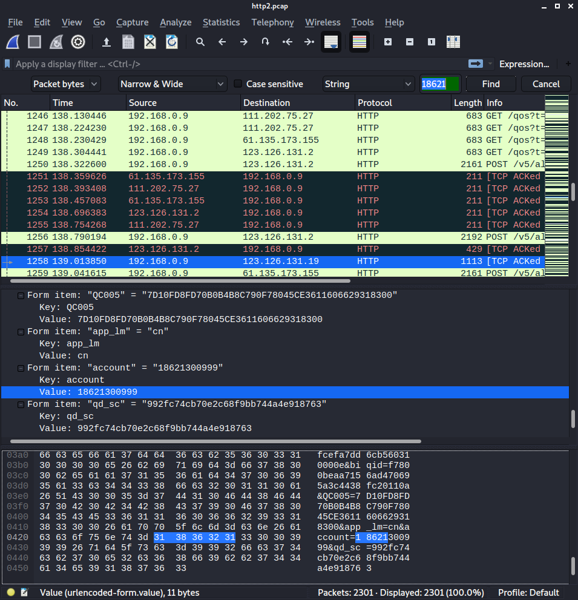
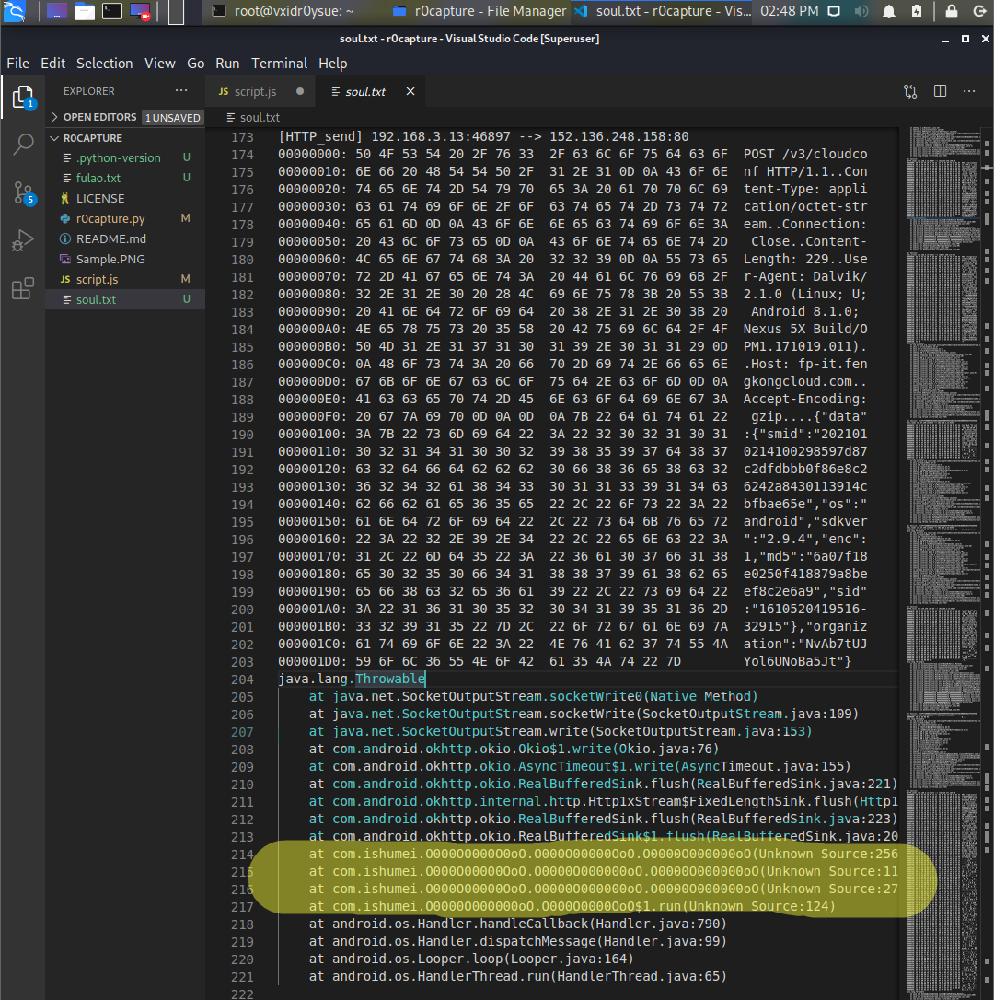
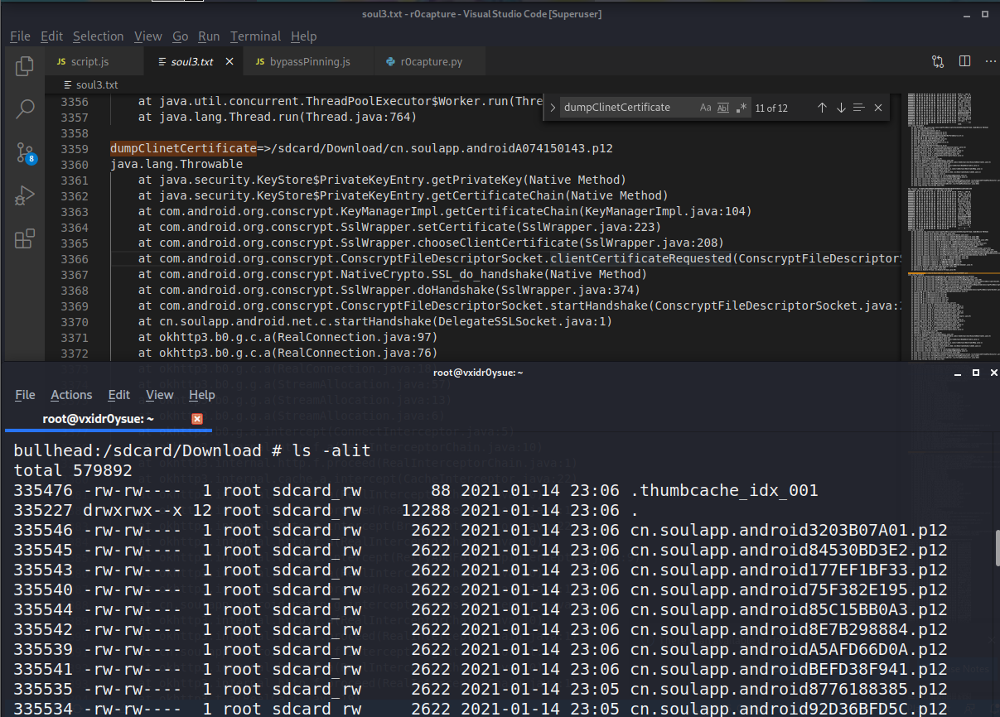
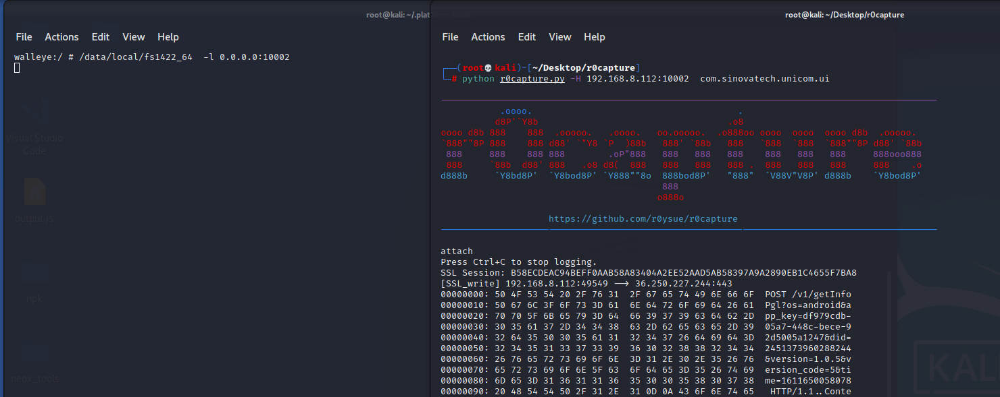

# r0capture

安卓应用层抓包通杀脚本

## 简介

- 仅限安卓平台，测试安卓7、8、9、10 可用 ；
- 无视所有证书校验或绑定，不用考虑任何证书的事情；
- 通杀TCP/IP四层模型中的应用层中的全部协议；
- 通杀协议包括：Http,WebSocket,Ftp,Xmpp,Imap,Smtp,Protobuf等等、以及它们的SSL版本；
- 通杀所有应用层框架，包括HttpUrlConnection、Okhttp1/3/4、Retrofit/Volley等等；
- 无视加固，不管是整体壳还是二代壳或VMP，不用考虑加固的事情；
- 如果有抓不到的情况欢迎提issue，或者直接加vx：r0ysue，进行反馈~

### January.14th 2021 update：增加几个辅助功能

- 增加App收发包函数定位功能
- 增加App客户端证书导出功能
- 新增host连接方式“-H”，用于Frida-server监听在非标准端口时的连接

## 用法

- Spawn 模式：

`$ python3 r0capture.py -U -f com.qiyi.video -v`

- Attach 模式，抓包内容保存成pcap文件供后续分析：

`$ python3 r0capture.py -U com.qiyi.video -v -p iqiyi.pcap`

建议使用`Attach`模式，从感兴趣的地方开始抓包，并且保存成`pcap`文件，供后续使用Wireshark进行分析。



- 收发包函数定位：`Spawn`和`attach`模式均默认开启；

> 可以使用`python r0capture.py -U -f cn.soulapp.android -v  >> soul3.txt`这样的命令将输出重定向至txt文件中稍后过滤内容



- 客户端证书导出功能：默认开启；必须以Spawm模式运行；

> 运行脚本之前必须手动给App加上存储卡读写权限；

> 并不是所有App都部署了服务器验证客户端的机制，只有配置了的才会在Apk中包含客户端证书

> 导出后的证书位于/sdcard/Download/包名xxx.p12路径，导出多次，每一份均可用，密码默认为：r0ysue，推荐使用[keystore-explorer](http://keystore-explorer.org/)打开查看证书。



- 新增host连接方式“-H”，用于Frida-server监听在非标准端口时的连接




PS：

> 这个项目基于[frida_ssl_logger](https://github.com/BigFaceCat2017/frida_ssl_logger)，之所以换个名字，只是侧重点不同。 原项目的侧重点在于抓ssl和跨平台，本项目的侧重点是抓到所有的包。

> 局限：部分开发实力过强的大厂或框架，采用的是自身的SSL框架，比如WebView、小程序或Flutter，这部分目前暂未支持。部分融合App本质上已经不属于安卓App，没有使用安卓系统的框架，无法支持。当然这部分App也是少数。暂不支持HTTP/2、或HTTP/3，该部分API在安卓系统上暂未普及或布署，为App自带，无法进行通用hook。各种模拟器架构、实现、环境较为复杂，建议珍爱生命、使用真机。暂未添加多进程支持，比如:service或:push等子进程，可以使用Frida的Child-gating来支持一下。支持多进程之后要考虑pcap文件的写入锁问题，可以用frida-tool的Reactor线程锁来支持一下。

## 以下是原项目的简介：

[https://github.com/BigFaceCat2017/frida_ssl_logger](https://github.com/BigFaceCat2017/frida_ssl_logger)

### frida_ssl_logger
ssl_logger based on frida
for from https://github.com/google/ssl_logger

### 修改内容
1. 优化了frida的JS脚本，修复了在新版frida上的语法错误；
2. 调整JS脚本，使其适配iOS和macOS，同时也兼容了Android；
3. 增加了更多的选项，使其能在多种情况下使用；

### Usage
  ```shell
    python3 ./ssl_logger.py  -U -f com.bfc.mm
    python3 ./ssl_logger.py -v  -p test.pcap  6666
  ````
