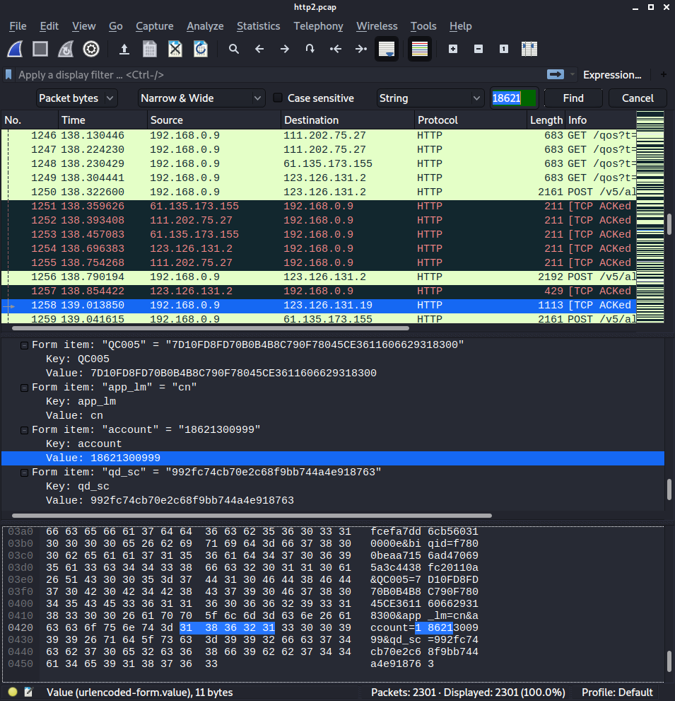
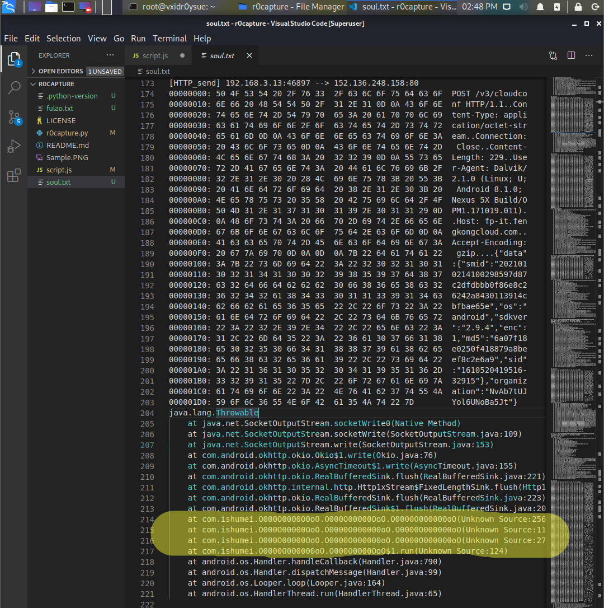
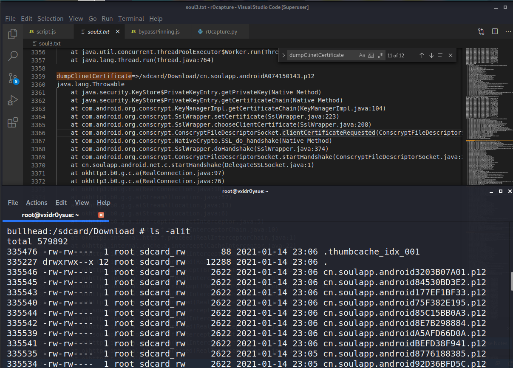
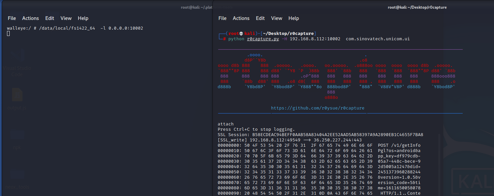
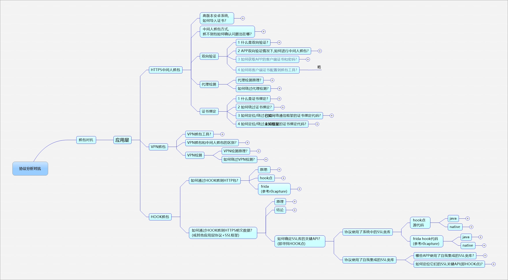

# r0capture

[中文](README.md) | [English](README.en.md) | **Tiếng Việt**

Script capture traffic tầng application cho Android.

## Giới Thiệu

- Chỉ dành cho Android. Đã test và dùng được trên Android 7, 8, 9, 10, 11, 12, 13, 14, 15 và 16.
- Bypass mọi cơ chế certificate validation hoặc certificate pinning. Không cần xử lý certificate.
- Capture toàn bộ protocol ở application layer trong TCP/IP four-layer model.
- Protocol được hỗ trợ gồm HTTP, WebSocket, FTP, XMPP, IMAP, SMTP, Protobuf và các SSL version của chúng.
- Hỗ trợ mọi application-layer framework, gồm HttpUrlConnection, OkHttp 1/3/4, Retrofit, Volley, v.v.
- Bypass app hardening, gồm full shell, second-generation shell hoặc VMP. Không cần xử lý hardening.
- Nếu có case không capture được traffic, hãy mở issue hoặc liên hệ WeChat: `r0ysue`.

### Cập nhật tháng 3/2026: hỗ trợ Frida 17

Recommended combinations: Frida 17 / Android 16, Frida 16.5.2 / Android 14, Frida 15.2.2 / Android 12.

### Cập nhật ngày 18/06/2023

Đã test trên Pixel 4 / Android 13 / KernelSU / Frida 16. Packet capture và certificate export hoạt động bình thường.

### Cập nhật ngày 14/01/2021: thêm một số tính năng hỗ trợ

- Thêm tính năng locate hàm send/receive packet của app.
- Thêm tính năng export client certificate của app.
- Thêm host connection mode `-H`, dùng khi Frida server listen trên non-standard port.

## Cách Dùng

- Môi trường khuyến nghị: [https://github.com/r0ysue/AndroidSecurityStudy/blob/master/FRIDA/A01/README.md](https://github.com/r0ysue/AndroidSecurityStudy/blob/master/FRIDA/A01/README.md)

Lưu ý: chỉ dùng được trên Android 7, 8, 9, 10 và 11. Không dùng emulator.

- Spawn mode:

`$ python3 r0capture.py -U -f com.coolapk.market -v`

- Attach mode, lưu captured traffic thành file pcap để phân tích sau:

`$ python3 r0capture.py -U 酷安 -v -p iqiyi.pcap`

Khuyến nghị dùng `Attach` mode, bắt đầu capture từ phần bạn quan tâm và lưu thành file `pcap` để phân tích bằng Wireshark sau đó.

> Frida version cũ dùng package name. Frida version mới dùng app name. App name phải là tên hiển thị bởi `frida-ps -U` sau khi mở app.



- Locate hàm send/receive packet: được bật mặc định trong cả `Spawn` và `Attach` mode.

> Có thể redirect output sang file txt để filter sau, ví dụ: `python r0capture.py -U -f cn.soulapp.android -v >> soul3.txt`.



- Client certificate export: được bật mặc định. Bắt buộc chạy ở Spawn mode.

> Trước khi chạy script, cần cấp thủ công storage read/write permission cho app.

> Không phải app nào cũng deploy cơ chế server verify client. Chỉ những app có config cơ chế này mới chứa client certificate trong APK.

> Certificate sau khi export nằm tại `/sdcard/Download/package_name_xxx.p12`. Nếu export nhiều lần, mỗi bản đều dùng được. Password mặc định là `r0ysue`. Khuyến nghị dùng [keystore-explorer](http://keystore-explorer.org/) để mở và xem certificate.



- Thêm host connection mode `-H`, dùng khi Frida server listen trên non-standard port. Một số app detect standard port của Frida, vì vậy chạy Frida server trên non-standard port có thể bypass detection.



## Cảm ơn [爱吃菠菜](https://bbs.pediy.com/user-760871.htm) đã tổng hợp knowledge points của project này




PS:

> Project này dựa trên [frida_ssl_logger](https://github.com/BigFaceCat2017/frida_ssl_logger). Việc đổi tên chỉ vì focus khác nhau. Project gốc focus vào SSL capture và cross-platform support, còn project này focus vào capture toàn bộ packet.

> Limitations: Một số công ty lớn hoặc framework có năng lực development mạnh dùng SSL framework riêng, ví dụ WebView, mini-program hoặc Flutter. Phần này hiện chưa support. Một số hybrid app về bản chất không còn là Android app và không dùng Android system framework, nên không thể support. Tuy nhiên nhóm app này chỉ là thiểu số. Hiện chưa support HTTP/2 hoặc HTTP/3. Các API này chưa phổ biến hoặc chưa deploy rộng trên Android system, thường do app tự bundle, nên không thể hook generic. Kiến trúc, implementation và environment của emulator khá phức tạp, vì vậy nên dùng real device. Chưa thêm multi-process support, ví dụ subprocess `:service` hoặc `:push`; có thể dùng Frida Child Gating để support một phần. Sau khi support multi-process, cần cân nhắc pcap write lock; có thể dùng Reactor thread lock của frida-tool để support.

## Giới thiệu project gốc

[https://github.com/BigFaceCat2017/frida_ssl_logger](https://github.com/BigFaceCat2017/frida_ssl_logger)

### frida_ssl_logger

ssl_logger based on frida, fork từ https://github.com/google/ssl_logger

### Changes

1. Optimize JS script của Frida và fix syntax error trên Frida version mới.
2. Điều chỉnh JS script để support iOS và macOS, đồng thời vẫn compatible với Android.
3. Thêm nhiều option hơn để dùng được trong nhiều case.

### Install Dependencies

```text
Python version >= 3.6
pip install loguru
pip install click
```

### Usage

```shell
python3 ./ssl_logger.py -U -f com.bfc.mm
python3 ./ssl_logger.py -v -p test.pcap 6666
```
